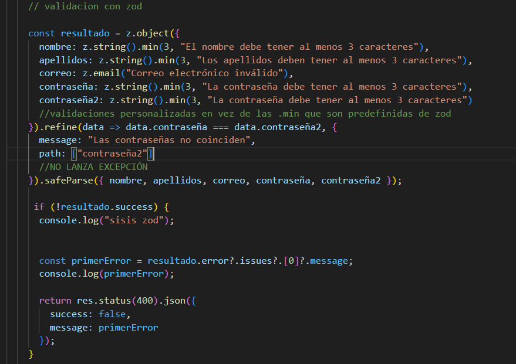
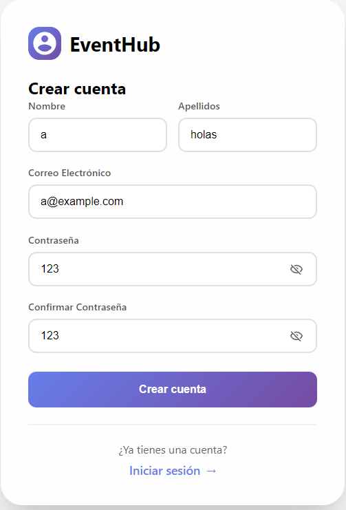
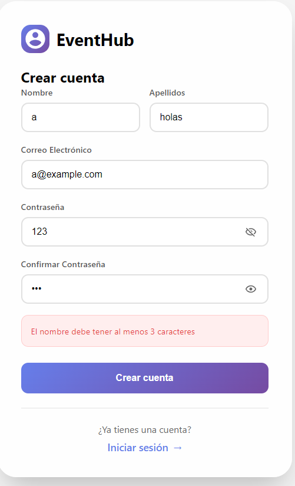

## Implementación de ZOD y bcryptjs

Para este proyecto se implementó **Zod**, una librería de validación de datos para el backend, específicamente en la parte de registro de usuario.

---

## ¿Por qué usarlo?

| Motivo | Explicación |
|--------|-------------|
| **Seguridad** | Los datos del frontend pueden ser manipulados. Zod valida en el backend que la información sea correcta antes de procesarla. |
| **Mensajes claros** | Permite personalizar mensajes de error para cada campo, mejorando la experiencia del usuario. |
| **Código limpio** | Evita tener decenas de `if` anidados para validar campos. Todo se define en un esquema legible. |

---

## Características principales

- **Validación de tipos** (strings, emails, longitudes mínimas)
- **Reglas personalizadas** con `refine` (ej: contraseñas coincidentes)
- **Mensajes de error personalizados** en español
- **Validación en el backend** (capa extra de seguridad)
- **Integración simple** con Express
- **Uso de `safeParse`** para evitar try/catch innecesarios

---

## Instalación

```bash
npm install zod
```
## Importar la libreria


```bash
const { z } = require('zod');
```


Una vez que ya importamos la libreria podemos ponernos manos a la obra y poder usarlo , para ello nos vamos a nuestro endpoint de creacion de usuario.



Añadimos esta parte despues de que se reciban los datos y creamos un "esquema" en donde estructuramos losdatos y le decimos el tipo de datios que debe ser o que se espera y tambvien como podemos ver algunos tiene un .min() que le indicamos el numero de caracteres o espacios minimos que debe tener y un mensaje que saltara el primero que incumpla esas condiciones.


## Prueba.
En nuestro registro del proyecto añadimos un nombre de menos de 3 caracteres para probar




Resultado de la prueba 




## Conclusion

La validación con Zod me ha parecido interesante porque normalmente lo que hacía era validarlo a mano con condicionales. Al principio tenía dudas, ya que en mi HTML ya especificaba el tipo de datos que debía llegar (con required, type="email", etc.), por lo que todo llegaba "bien" al backend. Sin embargo, he aprendido que siempre es mejor hacer las validaciones en el backend, porque las validaciones del HTML se pueden cambiar fácilmente o incluso saltarse, dejando la aplicación expuesta a datos incorrectos o maliciosos. Zod me ha permitido centralizar estas validaciones de forma limpia y profesional.


## Implementacion de bcryptjs.


A contimnuacion implementarremos bcryptjs en este proyecto para hashear las contraseña de nuestros usuarios.

### ¿Que es bcryptjs?

Es una libreria de js que implementa el algoritmo de hasheo bcrypt que ya existia, convertiria nuestra contraseña supersegura de base por ejemplo "admin123" y el resultado seria algo de este estilo: $2b$10$N9qo8uLOickgx2ZMRZoMy.Mr/.xR3UX5p5aP5Mx5i5m5i5m5i5m5i


### Como implementarlo ??

Para esta practica lo implementaremos en nuestro registro y login, para usaremos esta sencilla parte para el registro por ejemplo :

```bash
const saltRounds = 10;
const contraseñaHasheada = await bcrypt.hash(contraseña, saltRounds);
```
Básicamente le diremos el numero de vueltas que dara para  generar el hash en nuestro caso 10 es lo mas normal ya para que para sea mas seguro se pondria un numeroa mas alto pero cuanta mas seguridad mas tiempo tardaria y por lo tanto el servidor le llevaria mas tiempo , por regla general 10 es mas que suficiente.

Le pasaremos el parametro que hasheara y el numero de vueltas que dara, basicamente es como un bucle for que dara "x" numero de vueltas a la contraseña para hashearla y generara un hash que es lo que se vera en la base de datos.


### Inicio de sesion

Ahora que se genero un hash de nuestra contraseña por ejemplo en nuestro registro de aplicacion tendriamos que logearnos , y claro en el campo contraseña no pondras el hash que se genero por que ni lo sabes y ni acordarias por que si ya nos cuestas aprender un PIN a veces imaginate ese hash, por lo tanto para comparar si el campo de contraseña es el mismo en nuestro login añadiremos esta parte de codigo:

```bash
    const contraseñaValida = await bcrypt.compare(
      contraseña,
      usuario.contraseña
    );
```
Con bcrypt.compare compararemos la contraseña que le pasamos con el contrasña hasheada de la base de datos y si coincide ok y si no ok


 


